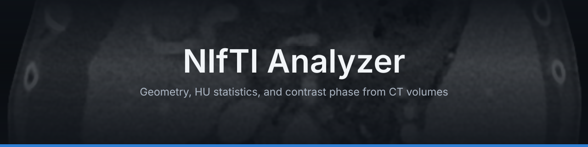

# NIfTI Analyzer

A desktop app that reads a NIfTI CT volume (`.nii` / `.nii.gz`) and reports:

- geometry: dimensions, coverage, pixel width, slice thickness, orientation, anisotropy
- intensity: the HU range
- contrast phase: phase, probability, post-injection time, its range and stddev,
  predicted by [TotalSegmentator](https://github.com/wasserth/TotalSegmentator)'s
  `totalseg_get_phase` (Wasserthal J. et al., "TotalSegmentator: Robust
  Segmentation of 104 Anatomic Structures in CT Images", Radiology:
  Artificial Intelligence, 2023, [doi:10.1148/ryai.230024](https://doi.org/10.1148/ryai.230024))

Results appear in a table and can be saved as CSV. No server, no browser:
it is a single window, and everything runs on your machine.

## What you need before installing

| | Linux | Windows |
|---|---|---|
| Python | 3.10 or newer (`python3 --version`) | 3.10 or newer, from [python.org](https://www.python.org/downloads/) |
| Disk space | ~3 GB (the phase model uses torch) | ~3 GB |
| Extras | none, the installer checks the rest | none, WebView2 ships with Windows 10/11 |

No Python on Windows yet? Install it first, and tick "Add python.exe to
PATH" in its installer.

## Install

Step 1. Get the code.

```bash
git clone <repo-url>
cd "NifTi Analyzer"
```

Step 2. Run the installer.

```bash
python3 install.py
```

On Windows, use `py install.py` instead.

Step 3. Answer its one possible question. On Linux, if system packages are
missing, the installer shows the exact `sudo apt-get install` command and
asks before running it.

Step 4. Wait. The first install downloads the phase model stack (~2 GB).
The installer picks the smaller CPU-only torch automatically when there is
no NVIDIA GPU.

That is all. The installer ends with "Done" after checking itself.

## Use

1. Start the app: type `nifti-analyzer` in a terminal, or open "NIfTI
   Analyzer" from the application menu (Linux) / Start Menu (Windows).
2. Pick a volume with Browse, or drop a `.nii` / `.nii.gz` file on the window.
3. Press "Run analysis".
4. Read the table. The geometry rows appear from the file header; the
   contrast-phase rows come from the model (seconds on GPU, minutes on CPU).
   The small "i" buttons explain the non-obvious metrics.
5. Press "Save result" to write the table as a CSV file.

The very first analysis also downloads the model weights (~1.5 GB, one time,
to `~/.totalsegmentator`).

## Update

```bash
git pull
python3 install.py
```

## Uninstall

```bash
python3 install.py --uninstall
```

Removes the app's environment and menu entry. The cloned folder and your
data stay untouched.
